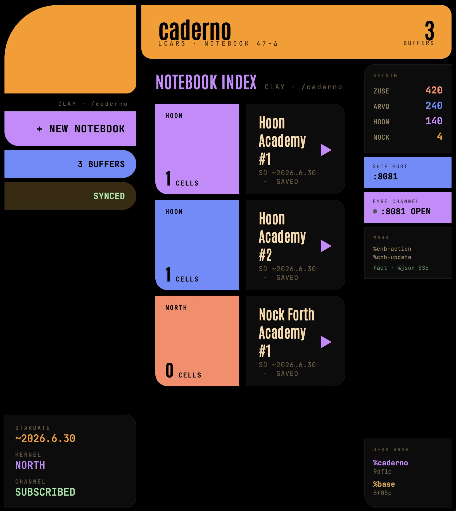

# caderno

A Hoon notebook for Urbit — Jupyter-style cells backed by a live ship.



## Kernels

- **Hoon** — built in; evaluates cells **in-process** via `ream` + `slap` against
  a persisted per-notebook subject. Works on any ship, no dependencies.
- **North** (`%north`) — a [Nock Forth](https://github.com/sigilante/north) REPL,
  driven over a sole session.
- **Any `/lib/shoe` agent that implements the `%eval-command` poke** — see the
  kernel contract below.

Hoon runs everywhere. Shoe kernels (North, etc.) additionally require the agent
installed and running, plus the `/x/sole/sessions` scry from
[urbit/urbit#7379](https://github.com/urbit/urbit/pull/7379) in your ship's
`/lib/shoe`, which powers kernel **discovery**. Without it, only the Hoon kernel
is offered.

> Dojo is **not** a caderno kernel: it is drum-based, not `/lib/shoe`, and does
> not implement `%eval-command`.

### Kernel contract (`%eval-command`)

A caderno kernel is any `/lib/shoe` agent that answers the `%eval-command` poke:

1. **Subscribe** — caderno watches `/sole/[our-ship]/[ses]` on the agent, which
   registers the session and yields an initial `%pro` prompt.
2. **Evaluate** — caderno pokes `%eval-command` with `[ses=@ta src=tape]`.
3. **Output** — the agent streams `%sole-effect` facts on that subscription:
   `%txt` lines are output; a terminal `%pro` (prompt) signals completion.

`%eval-command` is *not* part of upstream `/lib/shoe` today — North implements it
directly. Any agent that adds the same poke handler becomes a caderno kernel.

> **Running a notebook runs its code.** A Hoon cell is evaluated on *your* ship
> when you press Run — including any `.^` scries it contains. Treat a followed or
> forked notebook the same way you'd treat any downloaded code: read before you
> run.

## Publishing & following

- **Publish** a notebook to expose it, read-only, over a Gall subscription.
  Publishing is **public**: anyone who knows your ship — or looks it up — can
  follow a published notebook. There is no per-notebook access control yet.
- **Lookup** a ship to browse its published notebooks, then **Follow** one to get
  a live, read-only mirror that updates as the publisher edits.
- **Fork** a followed notebook for your own editable copy. A fork is a
  **snapshot, not a branch**: it does not track the publisher afterwards, and
  upstream changes never overwrite your local edits. To pick up later changes,
  fork again.

## Setup

### Development

```
cd ui
npm install
SHIP_URL=http://<your-ship>:<port> npm run dev
```

Then in your ship:

```
|install our %caderno
```

### Desk dependencies

The caderno desk requires the following files from base:

- `lib/sole.hoon`, `sur/sole.hoon` — sole protocol
- `mar/json.hoon` — JSON mark (from `%yard`)

And from `%landscape`:

- `lib/docket.hoon`, `mar/docket-0.hoon` — docket support

## Architecture

- `desk/app/caderno.hoon` — Gall agent. Manages notebook state, routes `%hoon` cells through `slap`, delegates shoe kernels via sole session client.
- `desk/sur/caderno.hoon` — shared types (`notebook`, `cell`, `action`, `update`)
- `ui/src/` — Vite + React frontend communicating via Eyre channel API
